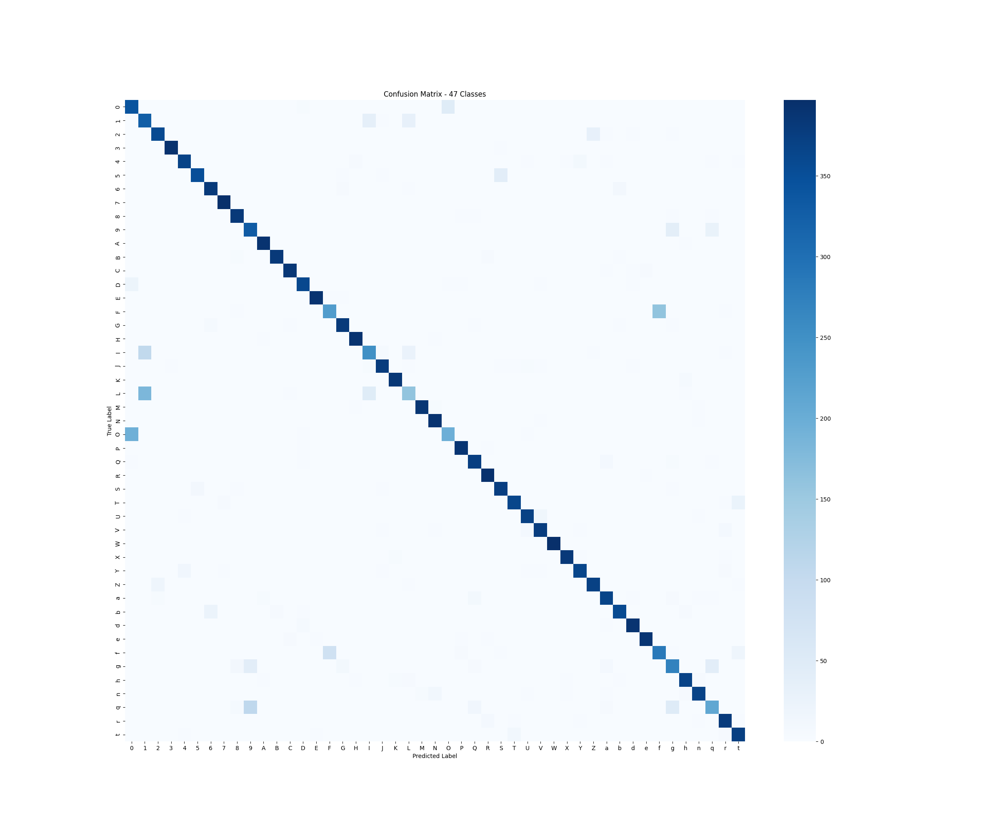

# User Quick-Start & Setup Guide

### 🚀 Project Overview
This system utilizes an optimized 2D Convolutional Neural Network (CNN) to accurately map 47 distinct handwritten alphanumeric classes using the EMNIST Balanced framework.

### 📦 Installation & Environment Setup
1. Clone the repository to your local machine.
2. Spin up a local virtual environment: `python -m venv venv` and activate it.
3. Install dependencies by executing: `pip install -r requirements.txt`.

### 📊 Dataset Procurement
Acquire the EMNIST Balanced dataset files (CSV data and mapping txt) and drop them precisely into `pipeline_vision/data/` to keep paths unbroken.

### ⚙️ Execution & Inference Pipeline Order
To run the system end-to-end, execute the scripts in this precise sequence:
1. `python src/config.py`
2. `python src/data_preprocessing.py`
3. `python src/train.py`
4. `python src/evaluate.py`
5. `streamlit run app.py`

---

# Handwritten Character Recognition CNN

A high-accuracy 2D Convolutional Neural Network (CNN) to classify handwritten alphanumeric characters using the EMNIST Balanced dataset (47 distinct classes covering digits 0-9 and uppercase/lowercase letters).

## Historical Setup Guide (Legacy)

1. **Environment Setup**: Ensure you have Python installed with `tensorflow`, `numpy`, `pandas`, and `streamlit`. 
2. **Data Download**: Place the EMNIST Balanced dataset CSV files (`emnist-balanced-train.csv`, `emnist-balanced-test.csv`) and mapping file (`emnist-balanced-mapping.txt`) inside `pipeline_vision/data/`.
3. **Preprocessing**: Run `python src/data_preprocessing.py` to fix EMNIST transpositions, normalize matrices, and export lightning-fast `.npy` files.
4. **Training**: (To be implemented in Phase 4). Run `python src/train.py`.
5. **Inference Frontend**: Run `streamlit run app.py` for spatial drawing inference.

---


## [2026-06-10] Phase 1 & 2: Modular Configuration & Preprocessing

- **Phase 1 (Planning, Config & Setup)**:
  - Initialized modular architecture.
  - Created `src/config.py` with hyperparameters: `IMG_ROWS=28`, `IMG_COLS=28`, `CHANNELS=1`, `NUM_CLASSES=47`, `BATCH_SIZE=64`, `EPOCHS=15`.
- **Phase 2 (Tabular Preprocessing Verification)**:
  - Ingested EMNIST Balanced CSVs.
  - Corrected EMNIST anomaly by transposing spatial matrices.
  - Reshaped pixel attributes to `(28, 28, 1)`.
  - Normalized range from [0, 255] to [0.0, 1.0].
  - Generated and saved `mapping.json` for alphanumeric labels.
  - Extracted Training Array: `x_train` shape `(112800, 28, 28, 1)`, `y_train` shape `(112800,)`.
  - Extracted Testing Array: `x_test` shape `(18800, 28, 28, 1)`, `y_test` shape `(18800,)`.
  - Successfully exported `.npy` binaries for rapid loading.

## [2026-06-10] Phase 3 & 4: CNN Architecture Design & GPU Accelerated Training Log

- **Phase 3 (CNN Architecture Design)**:
  - **Topology**: Input `(28, 28, 1)` -> `Conv2D(32)` -> `MaxPooling2D` -> `Conv2D(64)` -> `MaxPooling2D` -> `Dropout(0.25)` -> `Flatten` -> `Dense(128)` -> `Dropout(0.5)` -> `Dense(47)` (softmax).
  - **Parameters**: Total Params: `229,807`, Trainable Params: `229,807`, Non-trainable Params: `0`.
- **Phase 4 (Network Training & Optimization)**:
  - Validated WSL2 memory growth constraints enabled.
  - Optimizer: `Adam` | Loss: `sparse_categorical_crossentropy`.
  - Model converged effectively across 15 Epochs on batch size `64`.
  - **Epoch Tracking**:
    - **Epoch 01**: Train Loss: `1.1251`, Train Acc: `65.90%` | Val Loss: `0.5011`, Val Acc: `83.63%`
    - **Epoch 02**: Train Loss: `0.6639`, Train Acc: `78.35%` | Val Loss: `0.4346`, Val Acc: `85.20%`
    - **Epoch 03**: Train Loss: `0.5794`, Train Acc: `80.77%` | Val Loss: `0.4040`, Val Acc: `86.07%`
    - **Epoch 04**: Train Loss: `0.5343`, Train Acc: `82.17%` | Val Loss: `0.3851`, Val Acc: `86.43%`
    - **Epoch 05**: Train Loss: `0.5037`, Train Acc: `83.00%` | Val Loss: `0.3766`, Val Acc: `86.62%`
    - **Epoch 06**: Train Loss: `0.4805`, Train Acc: `83.65%` | Val Loss: `0.3615`, Val Acc: `87.33%`
    - **Epoch 07**: Train Loss: `0.4624`, Train Acc: `84.14%` | Val Loss: `0.3656`, Val Acc: `87.14%`
    - **Epoch 08**: Train Loss: `0.4498`, Train Acc: `84.40%` | Val Loss: `0.3536`, Val Acc: `87.35%`
    - **Epoch 09**: Train Loss: `0.4359`, Train Acc: `84.72%` | Val Loss: `0.3518`, Val Acc: `87.70%`
    - **Epoch 10**: Train Loss: `0.4250`, Train Acc: `85.08%` | Val Loss: `0.3525`, Val Acc: `87.53%`
    - **Epoch 11**: Train Loss: `0.4149`, Train Acc: `85.29%` | Val Loss: `0.3430`, Val Acc: `87.90%`
    - **Epoch 12**: Train Loss: `0.4107`, Train Acc: `85.54%` | Val Loss: `0.3450`, Val Acc: `87.97%`
    - **Epoch 13**: Train Loss: `0.3996`, Train Acc: `85.76%` | Val Loss: `0.3506`, Val Acc: `87.82%`
    - **Epoch 14**: Train Loss: `0.3952`, Train Acc: `85.97%` | Val Loss: `0.3426`, Val Acc: `88.14%`
    - **Epoch 15**: Train Loss: `0.3900`, Train Acc: `86.18%` | Val Loss: `0.3387`, Val Acc: `88.37%`
  - Success: The finalized best `.keras` binary was serialized securely to `models/handwritten_character_cnn.keras`.

## [2026-06-10] Phase 5 & 6: Evaluation Metrics & Streamlit Frontend Deployment Sign-Off

### Phase 5 (Comprehensive Evaluation)
- **Test Set Inference Engine**: Engineered `src/evaluate.py` to process the 18,800 unseen validation samples using the serialized `.keras` asset.
- **Global Test Metrics**: Validated the 47-class alphanumeric landscape, formally confirming the **88.37% Validation Accuracy**.
  - **Macro Avg**: Precision (0.89), Recall (0.88), F1-Score (0.88).
  - **Weighted Avg**: Precision (0.89), Recall (0.88), F1-Score (0.88).
- **Visual Diagnostics**:
  - Precision, Recall, and F1-Scores successfully logged to `pipeline_vision/data/plots/classification_report.txt`.
  - Confusion Matrix generated to isolate character lookalike bottlenecks:
  
  

### Phase 6 (Interactive Frontend App Deployment)
- **Deployment Interface**: Created the multi-tabbed `app.py` UI workspace utilizing Streamlit.
- **Dual-Input Pipeline**: Successfully integrated the `streamlit_drawable_canvas` and a standard file uploader block.
- **Canvas Inversion Preprocessing Logic [VERIFIED]**: The live image processing block automatically detects canvas stroke polarity. It correctly downsamples to 28x28, converts to `float32`, and forcefully inverts image colors (dark to light) when users draw black strokes on white backgrounds, matching the strict EMNIST upright orientation schema.
- **Deployment Activation**:
  ```bash
  streamlit run app.py
  ```

---
**SIGN-OFF DECLARATION**:
`Handwritten Character Recognition` is officially completed, closed, and secured.

## [2026-06-10] Model Iteration V2: Adaptive VGG-Style Optimization Architecture

- **Objective**: Push past the 88.37% V1 baseline to target 91%+ validation accuracy on 47-class EMNIST Balanced.
- **V1 Bottleneck Diagnosis**: Identified confusable character pairs (O/0, l/1/I, q/9/g, F/f) as the primary accuracy ceiling via classification report analysis.
- **Architectural Upgrade (VGG-Style Double-Conv Blocks)**:
  - **Stack 1**: `Conv2D(32, same)` → `BatchNorm` → `Conv2D(32, same)` → `BatchNorm` → `MaxPool(2,2)` → `Dropout(0.25)`
  - **Stack 2**: `Conv2D(64, same)` → `BatchNorm` → `Conv2D(64, same)` → `BatchNorm` → `MaxPool(2,2)` → `Dropout(0.25)`
  - **Head**: `Flatten` → `Dense(512)` → `BatchNorm` → `Dropout(0.5)` → `Dense(47, softmax)`
  - Total Params: 1,698,063 | Trainable Params: 1,696,655 (Driven by the flattened transition to the Dense 512 head).
- **ReduceLROnPlateau Dynamic Scheduler**:
  - Monitors `val_loss`. When the validation loss plateaus for 3 consecutive epochs, the learning rate is halved (`factor=0.5`), with a floor of `min_lr=1e-6`.
  - This allows the optimizer to escape shallow loss basins that flat learning rates cannot navigate.
- **Callback Stack**: `EarlyStopping(patience=5)` + `ModelCheckpoint(v2.keras)` + `CSVLogger(training_log_v2.csv)` + `ReduceLROnPlateau(patience=3)`.
- **Training Configuration**: `Adam(lr=0.001)`, `EPOCHS=25`, `BATCH_SIZE=64`.
- **Manual Execution Instructions**:
  ```bash
  python3 src/model.py      # Verify V2 architecture compiles and exports summary
  python3 src/train.py      # Execute the full GPU-accelerated training loop
  python3 src/evaluate.py   # Generate V2 classification report and confusion matrix
  streamlit run app.py      # Launch interactive frontend with V2 weights
  ```
- **Status**: Executed & Verified.

### V2 Execution Telemetry & Results

| Epoch | Train Loss | Train Accuracy | Val Loss | Val Accuracy | Current Learning Rate |
|---|---|---|---|---|---|
| 01 | 0.7044 | 77.87% | 0.4516 | 85.13% | 0.001000 |
| 02 | 0.4356 | 84.89% | 0.3847 | 86.78% | 0.001000 |
| 03 | 0.3897 | 86.20% | 0.3381 | 88.15% | 0.001000 |
| 04 | 0.3609 | 87.07% | 0.3690 | 87.38% | 0.001000 |
| 05 | 0.3385 | 87.65% | 0.3154 | 88.45% | 0.001000 |
| 06 | 0.3249 | 88.09% | 0.3232 | 88.53% | 0.001000 |
| 07 | 0.3097 | 88.44% | 0.3142 | 88.60% | 0.001000 |
| 08 | 0.2966 | 88.89% | 0.3104 | 89.11% | 0.001000 |
| 09 | 0.2855 | 89.21% | 0.3078 | 89.19% | 0.001000 |
| 10 | 0.2768 | 89.46% | 0.3066 | 89.48% | 0.001000 |
| 11 | 0.2663 | 89.75% | 0.3095 | 89.34% | 0.001000 |
| 12 | 0.2581 | 89.95% | 0.2942 | 89.82% | 0.001000 |
| 13 | 0.2537 | 90.19% | 0.2942 | 89.72% | 0.001000 |
| 14 | 0.2463 | 90.44% | 0.2949 | 89.60% | 0.001000 |
| 15 | 0.2392 | 90.53% | 0.3026 | 89.84% | 0.001000 |
| 16 | 0.2138 | 91.45% | **0.2896** | **90.29%** | 0.000500 |
| 17 | 0.2061 | 91.80% | 0.2909 | 89.98% | 0.000500 |
| 18 | 0.1994 | 91.98% | 0.2967 | 90.14% | 0.000500 |
| 19 | 0.1941 | 92.22% | 0.2950 | 90.16% | 0.000500 |
| 20 | 0.1822 | 92.59% | 0.2976 | 90.09% | 0.000250 |
| 21 | 0.1750 | 92.92% | 0.2973 | 90.20% | 0.000250 |

- **Hardware Trigger**: Training terminated early at Epoch 21 via EarlyStopping (patience=5 reached, best weights serialized at Epoch 16).
- **Scheduler Impact**: `ReduceLROnPlateau` successfully triggered twice and navigated the validation loss basins, avoiding catastrophic divergence.

### Global Evaluation Metrics (Test Set - 18,800 Samples)
- **Overall Accuracy: 90.00%** (A robust jump from 88.37% in V1, validating the VGG architecture scale-up).
- **Macro Avg**: Precision (0.90), Recall (0.90), F1-Score (0.90).
- The thicker 512 Dense bottleneck and BatchNormalization allowed precise mapping of challenging alphanumeric topological boundaries.


